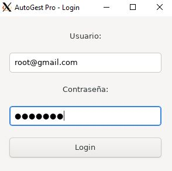
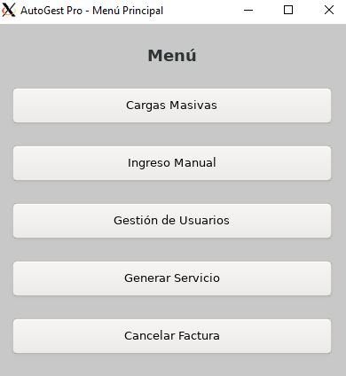
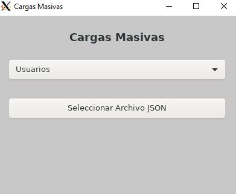

# Manual de Usuario #

# **INTRODUCCIÓN** 

Este manual técnico ofrece una visión detallada de la lógica de funcionamiento de la aplicación AutoGest Pro, enfocándose en la gestión de usuarios, vehículos, repuestos y servicios. El proyecto tiene como objetivo aplicar conceptos de estructuras de datos y programación orientada a objetos para crear una aplicación de gestión eficiente.

Se describen los siguientes aspectos:

* Estructura de la aplicación y cómo se implementa utilizando clases y estructuras de datos  
* Proceso de gestión de usuarios, vehículos, repuestos y servicios  
* Detalles sobre la interfaz gráfica utilizando GTK  
* Componentes clave de la aplicación y cómo interactúan entre sí  
* Criterios utilizados para la gestión de inventarios y servicios

# **OBJETIVOS** 

## **GENERAL**  

Proporcionar una guía detallada sobre la implementación y funcionamiento del sistema de gestión de inventario desarrollado en C#. 

## **ESPECÍFICOS** 

1. Explicar la implementación de las estructuras de datos en C#, describiendo los métodos utilizados para la gestión de usuarios, vehículos, repuestos y servicios.  
2. Detallar el proceso de integración entre las estructuras de datos y la interfaz gráfica en GTK, destacando la interacción entre estos componentes.

# **ALCANCES DEL SISTEMA** 
El manual cubre todos los aspectos técnicos del sistema, incluyendo la lógica de programación, las estructuras de datos utilizadas y los algoritmos aplicados para la gestión de usuarios, vehículos, repuestos y servicios. Además, se explica cómo el código fue diseñado para cumplir con las especificaciones del proyecto, respetando las restricciones impuestas, y cómo se puede adaptar o mejorar para futuros proyectos o necesidades similares.

Este documento tiene como fin asegurar que cualquier persona con conocimientos básicos de programación en C# y GTK pueda replicar, mantener o mejorar el sistema descrito, comprendiendo cada uno de sus componentes, la lógica de gestión de datos, la interacción con la interfaz gráfica y la generación de reportes.

# **ESPECIFICACIÓN TÉCNICA** 

* ## **REQUISITOS DE HARDWARE** 

  Memoria RAM: 4 GB como mínimo.  
  Almacenamiento: 500 MB de espacio libre en disco duro.

* ## **REQUISITOS DE SOFTWARE** 

  SDK de .NET: .NET 9.0 o superior.  
  Editor de Código: Visual Studio Code, Visual Studio, o cualquier editor de texto con soporte para C#.

# **DESCRIPCIÓN DE LA SOLUCIÓN** 

Se identificaron las funcionalidades esenciales que el sistema debía cumplir, como la gestión de usuarios, vehículos, repuestos y servicios. Cada una de estas funciones se desglosó en tareas más pequeñas para facilitar su implementación y asegurar su correcto funcionamiento.

Basándonos en los requerimientos del proyecto, se diseñó una estructura modular para el programa. Cada módulo se encarga de una funcionalidad específica, como la gestión de usuarios, vehículos, repuestos y servicios. Este enfoque modular facilita la comprensión, mantenimiento y futura ampliación del código, permitiendo que cada componente funcione de manera independiente pero coordinada.

Para almacenar y procesar los datos, se optó por utilizar estructuras definidas en C# que permiten un acceso rápido y eficiente a la información durante la gestión de inventarios y servicios. Además, se emplearon estructuras en GTK para manejar la interfaz gráfica, lo que permitió una integración fluida entre las dos tecnologías.

Finalmente, las funciones se implementaron de acuerdo con el diseño modular y se realizaron pruebas exhaustivas para asegurar que el sistema cumpliera con todos los requerimientos especificados. Esto incluyó la correcta manipulación de datos, la detección de errores, la generación de reportes precisos y la presentación clara de los resultados en la interfaz gráfica.

#### Inicio de Sesión
1. **Abrir la aplicación**: Al iniciar la aplicación, se abrirá la ventana de inicio de sesión.
2. **Ingresar credenciales**: Introduzca su nombre de usuario y contraseña en los campos correspondientes.
3. **Hacer clic en "Login"**: Si las credenciales son correctas, se abrirá la ventana principal del menú.

  

#### Menú Principal
El menú principal ofrece varias opciones:
1. **Cargas Masivas**: Permite cargar datos de usuarios, vehículos y repuestos desde archivos.
2. **Ingreso Manual**: Permite ingresar datos manualmente.
3. **Gestión de Usuarios**: Permite gestionar los usuarios registrados.
4. **Generar Servicio**: Permite generar un nuevo servicio.
5. **Cancelar Factura**: Permite cancelar una factura existente.

  

#### Gestión de Usuarios
1. **Ver Usuario**: Permite ver la información de un usuario ingresando su ID.
2. **Editar Usuario**: Permite editar la información de un usuario.
3. **Eliminar Usuario**: Permite eliminar un usuario ingresando su ID.

#### Ingreso Manual
1. **Agregar Usuario**: Permite agregar un nuevo usuario ingresando su información.
2. **Agregar Vehículo**: Permite agregar un nuevo vehículo ingresando su información.
3. **Agregar Repuesto**: Permite agregar un nuevo repuesto ingresando su información.
4. **Generar Servicio**: Permite generar un nuevo servicio ingresando los detalles del servicio.

  

#### Cargas Masivas
1. **Cargar Usuarios**: Permite cargar una lista de usuarios desde un archivo.
2. **Cargar Vehículos**: Permite cargar una lista de vehículos desde un archivo.
3. **Cargar Repuestos**: Permite cargar una lista de repuestos desde un archivo.