# Manual de Usuario #

## **INTRODUCCIÓN**

Este manual ofrece una guía detallada sobre el uso de la aplicación **AutoGest Pro**, diseñada para la gestión de usuarios, vehículos, repuestos, servicios y facturas. La aplicación utiliza estructuras de datos avanzadas y una interfaz gráfica desarrollada en **GTK** para proporcionar una experiencia eficiente y amigable.

Se describen los siguientes aspectos:

- Cómo iniciar sesión en el sistema.
- Uso del menú principal para acceder a las funcionalidades clave.
- Gestión de usuarios, vehículos, repuestos y servicios.
- Visualización y cancelación de facturas.
- Generación de reportes gráficos.

---

## **OBJETIVOS**

### **GENERAL**

Proporcionar una guía clara y práctica para que los usuarios puedan utilizar todas las funcionalidades de **AutoGest Pro** de manera eficiente.

### **ESPECÍFICOS**

1. Explicar cómo interactuar con las diferentes ventanas del sistema.
2. Detallar los pasos para realizar tareas como la gestión de usuarios, vehículos, repuestos y servicios.
3. Describir el proceso de visualización y cancelación de facturas.
4. Mostrar cómo generar reportes gráficos de las estructuras de datos.

---

## **REQUISITOS DEL SISTEMA**

### **REQUISITOS DE HARDWARE**

- **Memoria RAM:** 4 GB como mínimo.
- **Almacenamiento:** 500 MB de espacio libre en disco duro.

### **REQUISITOS DE SOFTWARE**

- **SDK de .NET:** .NET 9.0 o superior.
- **Editor de Código:** Visual Studio Code, Visual Studio, o cualquier editor de texto con soporte para C#.

---

## **FLUJO DEL PROGRAMA**

### **Inicio de Sesión**

1. **Abrir la aplicación:** Al iniciar la aplicación, se abrirá la ventana de inicio de sesión.
2. **Ingresar credenciales:**
   - Si eres administrador, utiliza las credenciales predeterminadas:
     - **Correo:** `admin@usac.com`
     - **Contraseña:** `admin123`
   - Si eres un usuario registrado, ingresa tu correo y contraseña.
3. **Hacer clic en "Iniciar Sesión":**
   - Si las credenciales son correctas:
     - El administrador accederá al **Menú de Administrador**.
     - Los usuarios registrados accederán al **Menú de Usuario**.
   - Si las credenciales son incorrectas, se mostrará un mensaje de error.

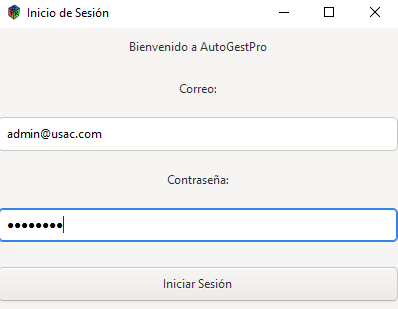

---

### **Menú Principal**

#### **Menú de Administrador**

El administrador tiene acceso a las siguientes opciones:

1. **Cargas Masivas:** Permite cargar datos de usuarios, vehículos y repuestos desde archivos JSON.
2. **Inserción de Usuarios:** Permite registrar nuevos usuarios en el sistema.
3. **Gestión de Entidades:** Permite buscar y visualizar información de usuarios y vehículos.
4. **Visualización de Repuestos:** Muestra los repuestos almacenados en el sistema en diferentes órdenes (preorden, inorden, postorden).
5. **Generar Servicios:** Permite registrar un nuevo servicio y generar automáticamente una factura asociada.
6. **Control de Logueo:** Muestra un registro de las entradas y salidas de los usuarios.
7. **Generar Reportes:** Genera gráficos de las estructuras de datos utilizadas en el sistema.
8. **Generar Backup:** Permite crear un respaldo de los datos del sistema.
9. **Cargar Backup:** Permite restaurar los datos desde un respaldo previamente generado.

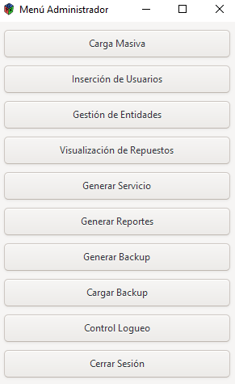

#### **Menú de Usuario**

Los usuarios registrados tienen acceso a las siguientes opciones:

1. **Mis Vehículos:** Permite visualizar los vehículos registrados por el usuario.
2. **Servicios Realizados:** Muestra los servicios registrados en el sistema asociados a los vehículos del usuario.
3. **Facturas Pendientes:** Permite visualizar y pagar las facturas pendientes de pago.

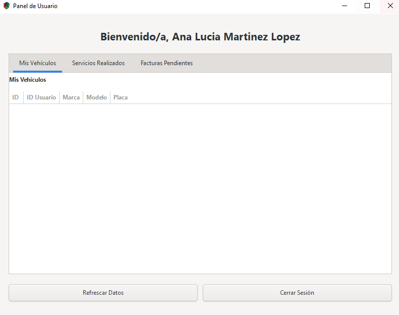

---

## **FUNCIONALIDADES**

### **Cargas Masivas**

1. Selecciona la opción **Cargas Masivas** en el menú del administrador.
2. Elige la categoría que deseas cargar: `Usuarios`, `Vehículos` o `Repuestos`.
3. Selecciona un archivo JSON con los datos correspondientes.
4. La aplicación procesará el archivo y cargará los datos en las estructuras correspondientes.

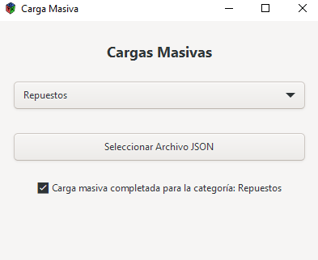

---

### **Inserción de Usuarios**

1. Selecciona la opción **Inserción de Usuarios** en el menú del administrador.
2. Ingresa los datos del usuario:
   - ID del usuario.
   - Nombres.
   - Apellidos.
   - Correo electrónico.
   - Edad.
   - Contraseña.
3. Haz clic en **Guardar** para registrar al usuario.

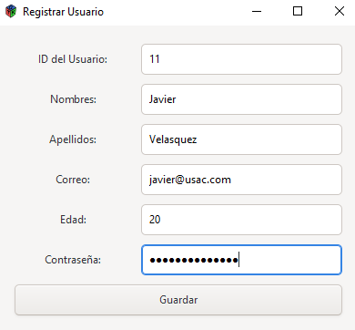

---

### **Gestión de Entidades**

1. Selecciona la opción **Gestión de Entidades** en el menú del administrador.
2. Ingresa el ID del usuario o vehículo que deseas buscar.
3. Haz clic en **Ver Usuario** o **Ver Vehículo** según corresponda.
4. La información del usuario o vehículo se mostrará en pantalla.

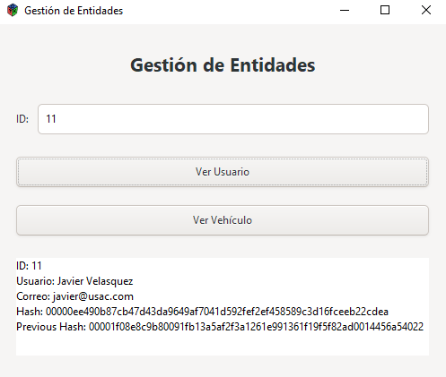

---

### **Visualización de Repuestos**

1. Selecciona la opción **Visualización de Repuestos** en el menú del administrador.
2. Elige el orden de visualización: `PRE-ORDEN`, `IN-ORDEN` o `POST-ORDEN`.
3. La tabla mostrará los repuestos en el orden seleccionado.

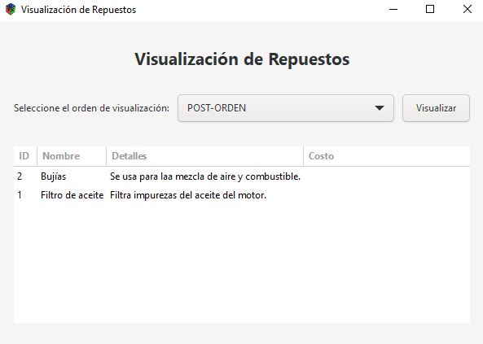

---

### **Generar Servicios**

1. Selecciona la opción **Generar Servicios** en el menú del administrador.
2. Ingresa los datos del servicio:
   - ID del servicio.
   - ID del repuesto.
   - ID del vehículo.
   - Detalles del servicio.
   - Costo del servicio.
3. Haz clic en **Guardar** para registrar el servicio.
4. La aplicación generará automáticamente una factura asociada.

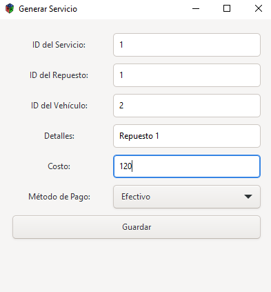

---

### **Control de Logueo**

1. Selecciona la opción **Control de Logueo** en el menú del administrador.
2. La ventana mostrará un registro de las entradas y salidas de los usuarios.
3. Puedes cargar un archivo JSON con registros adicionales o exportar el log actual.

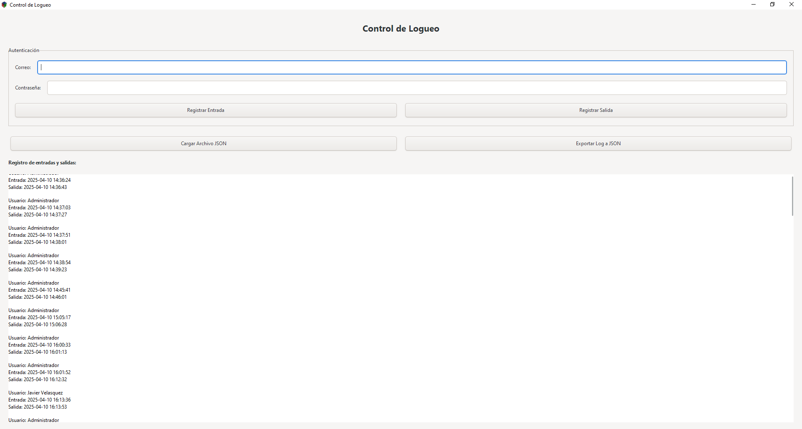

---

### **Generar Reportes**

1. Selecciona la opción **Generar Reportes** en el menú del administrador.
2. Elige la estructura de datos que deseas graficar:
   - Blockchain de Usuarios.
   - Lista Doble de Vehículos.
   - Árbol AVL de Repuestos.
   - Árbol Binario de Servicios.
   - Árbol Merkle de Facturas.
   - Grafo No Dirigido.
3. Haz clic en **Generar Gráfica**.
4. La aplicación generará un archivo gráfico que representa la estructura seleccionada.

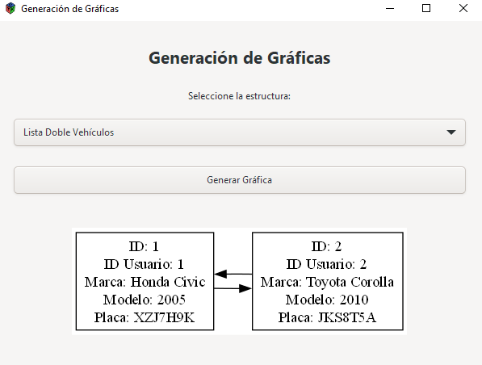

---

### **Mis Vehículos**

1. Selecciona la pestaña **Mis Vehículos** en el menú del usuario.
2. La tabla mostrará todos los vehículos registrados por el usuario.

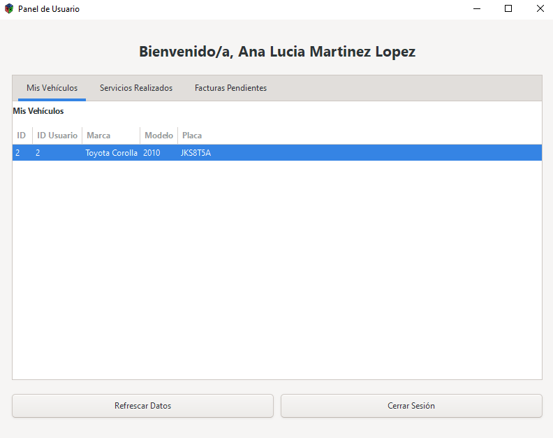

---

### **Servicios Realizados**

1. Selecciona la pestaña **Servicios Realizados** en el menú del usuario.
2. La tabla mostrará todos los servicios realizados asociados a los vehículos del usuario.

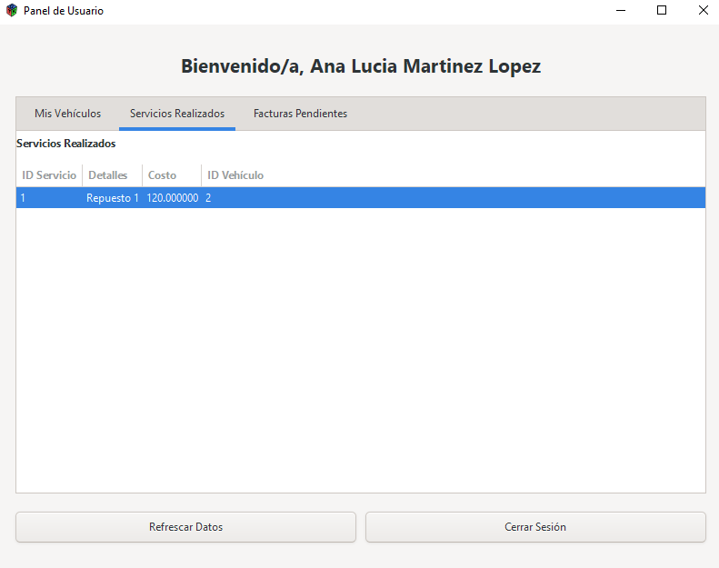

---

### **Facturas Pendientes**

1. Selecciona la pestaña **Facturas Pendientes** en el menú del usuario.
2. La tabla mostrará todas las facturas pendientes de pago.
3. Selecciona una factura y haz clic en **Pagar** para cancelarla.

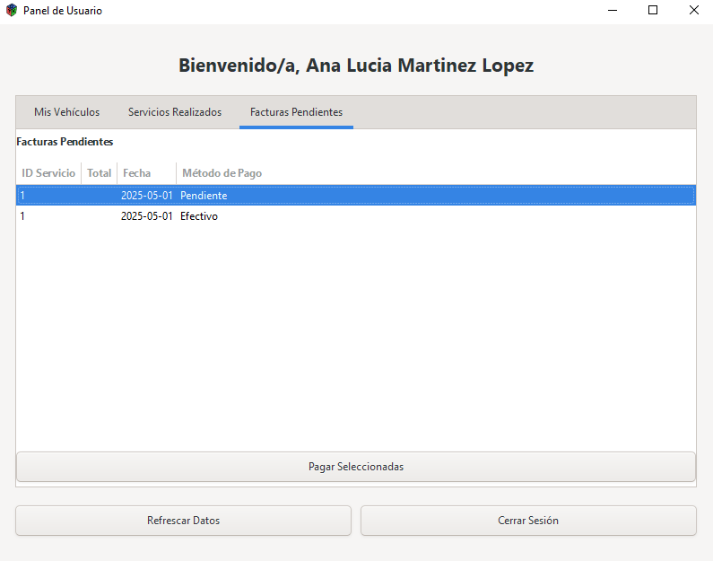

---

## **CONCLUSIÓN**

Este manual proporciona una guía completa para utilizar **AutoGest Pro**. Siguiendo los pasos descritos, los usuarios podrán gestionar eficientemente los datos del sistema, realizar operaciones clave y generar reportes gráficos para análisis.