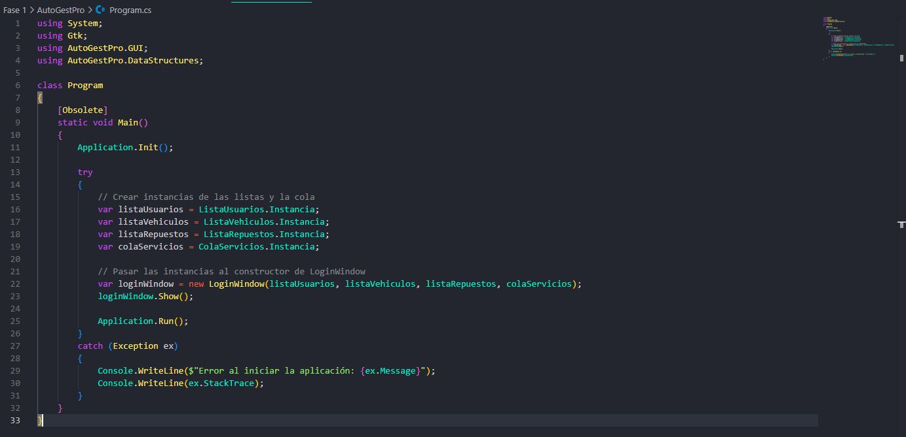

# Manual Técnico

# **INTRODUCCIÓN** 

Este manual técnico ofrece una visión detallada de la lógica de funcionamiento de la aplicación AutoGest Pro, enfocándose en la gestión de usuarios, vehículos, repuestos y servicios. El proyecto tiene como objetivo aplicar conceptos de estructuras de datos y programación orientada a objetos para crear una aplicación de gestión eficiente.

Se describen los siguientes aspectos:

* Estructura de la aplicación y cómo se implementa utilizando clases y estructuras de datos  
* Proceso de gestión de usuarios, vehículos, repuestos y servicios  
* Detalles sobre la interfaz gráfica utilizando GTK  
* Componentes clave de la aplicación y cómo interactúan entre sí  
* Criterios utilizados para la gestión de inventarios y servicios

# **OBJETIVOS** 

## **GENERAL**  

Proporcionar una guía detallada sobre la implementación y funcionamiento del sistema de gestión de inventario desarrollado en C#. 

## **ESPECÍFICOS** 

1. Explicar la implementación de las estructuras de datos en C#, describiendo los métodos utilizados para la gestión de usuarios, vehículos, repuestos y servicios.  
2. Detallar el proceso de integración entre las estructuras de datos y la interfaz gráfica en GTK, destacando la interacción entre estos componentes.

# **ALCANCES DEL SISTEMA** 
El manual cubre todos los aspectos técnicos del sistema, incluyendo la lógica de programación, las estructuras de datos utilizadas y los algoritmos aplicados para la gestión de usuarios, vehículos, repuestos y servicios. Además, se explica cómo el código fue diseñado para cumplir con las especificaciones del proyecto, respetando las restricciones impuestas, y cómo se puede adaptar o mejorar para futuros proyectos o necesidades similares.

Este documento tiene como fin asegurar que cualquier persona con conocimientos básicos de programación en C# y GTK pueda replicar, mantener o mejorar el sistema descrito, comprendiendo cada uno de sus componentes, la lógica de gestión de datos, la interacción con la interfaz gráfica y la generación de reportes.

# **ESPECIFICACIÓN TÉCNICA** 

* ## **REQUISITOS DE HARDWARE** 

  Memoria RAM: 4 GB como mínimo.  
  Almacenamiento: 500 MB de espacio libre en disco duro.

* ## **REQUISITOS DE SOFTWARE** 

  SDK de .NET: .NET 9.0 o superior.  
  Editor de Código: Visual Studio Code, Visual Studio, o cualquier editor de texto con soporte para C#.

# **DESCRIPCIÓN DE LA SOLUCIÓN** 

Se identificaron las funcionalidades esenciales que el sistema debía cumplir, como la gestión de usuarios, vehículos, repuestos y servicios. Cada una de estas funciones se desglosó en tareas más pequeñas para facilitar su implementación y asegurar su correcto funcionamiento.

Basándonos en los requerimientos del proyecto, se diseñó una estructura modular para el programa. Cada módulo se encarga de una funcionalidad específica, como la gestión de usuarios, vehículos, repuestos y servicios. Este enfoque modular facilita la comprensión, mantenimiento y futura ampliación del código, permitiendo que cada componente funcione de manera independiente pero coordinada.

Para almacenar y procesar los datos, se optó por utilizar estructuras definidas en C# que permiten un acceso rápido y eficiente a la información durante la gestión de inventarios y servicios. Además, se emplearon estructuras en GTK para manejar la interfaz gráfica, lo que permitió una integración fluida entre las dos tecnologías.

Finalmente, las funciones se implementaron de acuerdo con el diseño modular y se realizaron pruebas exhaustivas para asegurar que el sistema cumpliera con todos los requerimientos especificados. Esto incluyó la correcta manipulación de datos, la detección de errores, la generación de reportes precisos y la presentación clara de los resultados en la interfaz gráfica.

#### Clases Principales

1. **Program**
   - Punto de entrada de la aplicación.
   - Inicializa la aplicación GTK y crea instancias de las listas y la cola.
   - Muestra la ventana de inicio de sesión.

)

2. **LoginWindow**
   - Ventana de inicio de sesión.
   - Valida las credenciales del usuario y abre la ventana principal del menú.

3. **MainWindow**
   - Ventana principal del menú.
   - Ofrece opciones para cargas masivas, ingreso manual, gestión de usuarios, generación de servicios y cancelación de facturas.

(

4. **GestionUsuariosWindow**
   - Ventana para gestionar usuarios.
   - Permite ver, editar y eliminar usuarios.

#### Estructuras de Datos

1. **ListaUsuarios**
   - Lista enlazada de usuarios.
   - Métodos para agregar, buscar, editar y eliminar usuarios.

2. **ListaVehiculos**
   - Lista doblemente enlazada de vehículos.
   - Métodos para agregar, buscar y eliminar vehículos.

3. **ListaRepuestos**
   - Lista circular de repuestos.
   - Métodos para agregar, buscar y eliminar repuestos.

4. **ColaServicios**
   - Cola de servicios.
   - Métodos para encolar y desencolar servicios.
   

5. **PilaFacturas**
   - Pila de facturas.
   - Métodos para apilar y desapilar facturas.

6. **MatrizBitacora**
   - Matriz de bitácora para registrar la relación entre vehículos y repuestos.
   - Métodos para agregar registros y mostrar la bitácora.

#### Flujo del Programa

1. **Inicio de la Aplicación**
   - La clase `Program` inicializa la aplicación GTK y muestra la ventana de inicio de sesión (`LoginWindow`).

2. **Inicio de Sesión**
   - El usuario ingresa sus credenciales en `LoginWindow`.
   - Si las credenciales son correctas, se muestra la ventana principal del menú (`MainWindow`).

3. **Menú Principal**
   - El usuario selecciona una opción del menú en `MainWindow`.
   - Dependiendo de la opción seleccionada, se muestra la ventana correspondiente (por ejemplo, `GestionUsuariosWindow` para la gestión de usuarios).

4. **Gestión de Usuarios**
   - El usuario puede ver, editar o eliminar usuarios en `GestionUsuariosWindow`.

5. **Ingreso Manual y Cargas Masivas**
   - El usuario puede agregar datos manualmente o cargar datos desde archivos en las ventanas correspondientes.

#### Detalles Adicionales

- **Uso de Punteros**: Las estructuras de datos utilizan punteros para la gestión de memoria y la manipulación de nodos.
- **Manejo de Excepciones**: El programa maneja excepciones para asegurar que los errores se capturen y se muestren mensajes adecuados al usuario.
- **Interfaz Gráfica**: La interfaz gráfica está construida utilizando GTK, con ventanas y widgets para la interacción del usuario.